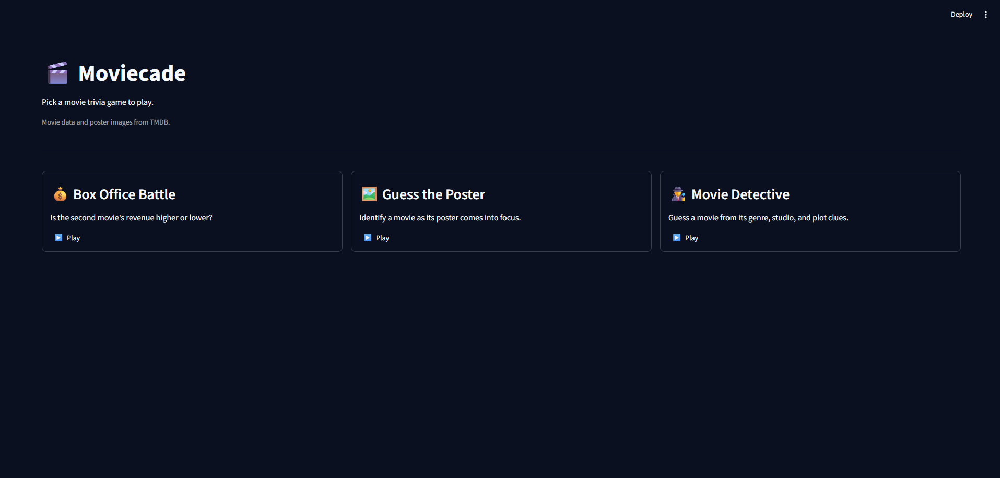
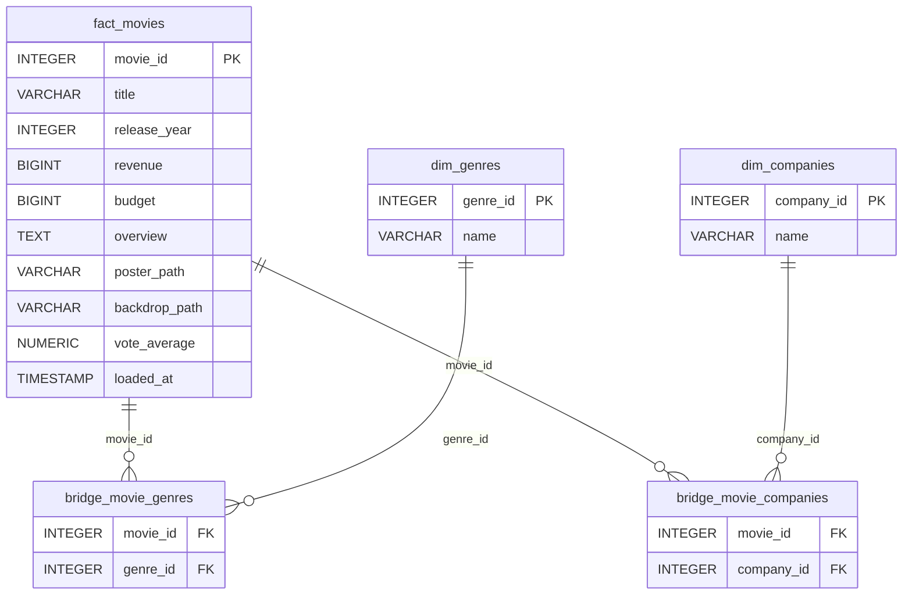
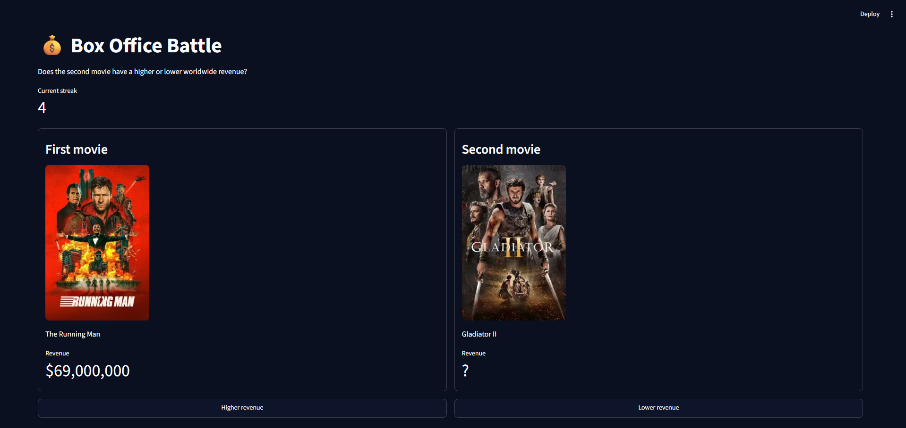
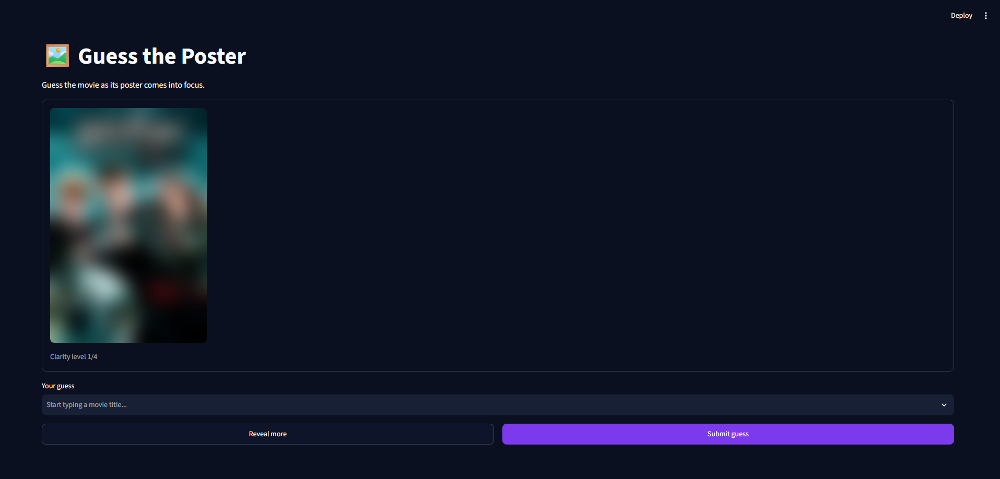
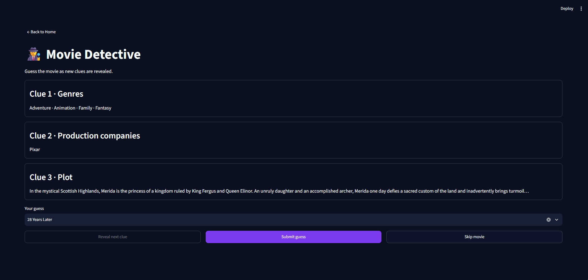
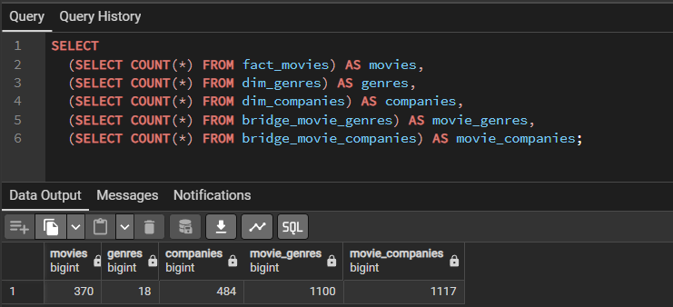
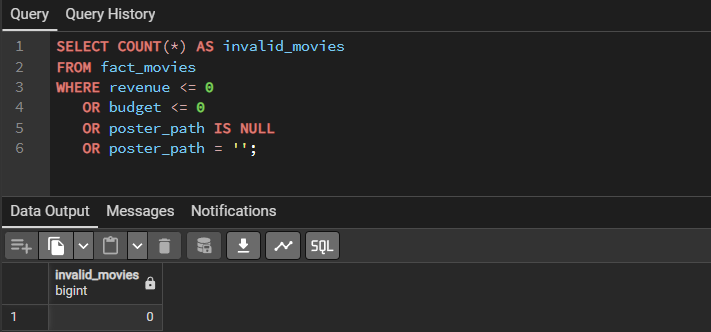

# Moviecade


Moviecade is a local batch data engineering project that turns movie data from
TMDB into a PostgreSQL star schema. A small Streamlit arcade uses the resulting
tables for three movie guessing games. The main focus is the ETL process, data
modeling, and automated tests.

One modeled dataset feeds three different games: revenue comparisons, poster
recognition, and clues assembled from movie, genre, and company tables. This
lets the arcade demonstrate the usefulness of the data model beyond a single
report or chart.



## Data flow

```text
TMDB Discover API ──> data/raw/movies.json
                              │ movie IDs
                              ▼
TMDB Movie Details API ──> data/raw/movies_detail.json
                              │
                              ▼
                       Python / pandas transform
                              │
                              ▼
                    PostgreSQL star schema
                              │
                              ▼
                       Streamlit arcade
```

The pipeline is run manually with `python -m script.main`. Each run calls TMDB
again and overwrites the local JSON files. These files are staging artifacts
for inspection and for rerunning the transform separately. They are excluded
from Git.

## ETL process

### 1. Extract

[`script/extract.py`](script/extract.py) fetches pages from TMDB's Discover API
and saves the results to `data/raw/movies.json`. It then requests details for
each movie ID using a thread pool (four workers by default) and writes
`data/raw/movies_detail.json`. The detail response supplies fields that the
games need, including revenue, budget, genres, production companies, overview,
and poster path. A rate limit response (`429`) is retried once after five
seconds; failed detail requests are skipped.

### 2. Transform

[`script/transform.py`](script/transform.py) reads the detailed JSON and
filters out movies with nonpositive revenue or budget, or without a poster.
It extracts the release year and splits nested genres and production companies
into five pandas DataFrames that match the database tables. Genre and company
IDs are collected into dimensions; movie-to-genre and movie-to-company pairs
become bridge rows.

### 3. Load

[`script/load.py`](script/load.py) loads all five DataFrames into PostgreSQL
inside one SQLAlchemy transaction (`engine.begin()`). Movies and dimensions use
`ON CONFLICT DO UPDATE`; bridge tables use `ON CONFLICT DO NOTHING`. A failure
during the load rolls back the transaction. The schema is defined in
[`db/schema.sql`](db/schema.sql), and [`script/main.py`](script/main.py) runs
the connection check, schema setup, extract, transform, and load in order.
Repeated loads update existing movie and dimension rows and ignore duplicate
bridge pairs. Bridge pairs that disappear from TMDB are not deleted by the
current load logic.

## Data model

`script/transform.py` turns each eligible TMDB movie detail record into a movie
row and separates its nested genres and production companies. It returns five
DataFrames that match the tables defined in [`db/schema.sql`](db/schema.sql).

### Transformation rules

| Source data | Rule | Result |
| :--- | :--- | :--- |
| Movie details | Keep movies with `revenue > 0`, `budget > 0`, and a `poster_path` | One row per retained movie in `fact_movies` |
| `id`, `title`, `release_date`, financial and display fields | Rename `id` to `movie_id`; take the year from `release_date` when present | Movie attributes in `fact_movies` |
| Nested `genres[]` | Deduplicate genres by TMDB genre ID; create one movie–genre pair for each entry | `dim_genres` and `bridge_movie_genres` |
| Nested `production_companies[]` | Deduplicate companies by TMDB company ID; create one movie–company pair for each entry | `dim_companies` and `bridge_movie_companies` |

**Modeling choice:** genres and companies can each have multiple values per
movie, so the fact table stores neither as a single column. The two bridge
tables preserve those many-to-many relationships for SQL joins.

### Schema relationships



### Table dictionary

| Table | Grain and key | Columns / role |
| :--- | :--- | :--- |
| **`fact_movies`** | One movie; PK `movie_id` (TMDB ID) | `title`, `release_year`, `revenue`, `budget`, `overview`, `poster_path`, `backdrop_path`, `vote_average`; PostgreSQL sets `loaded_at` by default |
| **`dim_genres`** | One genre; PK `genre_id` | Genre `name` |
| **`dim_companies`** | One production company; PK `company_id` | Company `name` |
| **`bridge_movie_genres`** | One movie–genre pair; composite PK (`movie_id`, `genre_id`) | Both columns are FKs to `fact_movies` and `dim_genres` |
| **`bridge_movie_companies`** | One movie–company pair; composite PK (`movie_id`, `company_id`) | Both columns are FKs to `fact_movies` and `dim_companies` |

**Transform vs. database:** `loaded_at` is added by PostgreSQL during insert,
not by the Transform step. The Transform step requires a poster for every
retained movie even though the SQL column itself allows `NULL`.

### How the games use the model

| Game | Data used |
| --- | --- |
| Box Office Battle | `fact_movies.revenue`, title, and poster path |
| Guess the Poster | `fact_movies.poster_path` and title |
| Movie Detective | Movie facts joined through both bridge tables to genres and production companies |

### Arcade preview

**Box Office Battle:** two posters and movie titles are shown while the second
movie's revenue stays hidden until the player guesses.



**Guess the Poster:** the poster starts blurred and becomes clearer when the
player requests a hint or makes a wrong guess.



**Movie Detective:** genres, production companies, and plot details are
revealed in stages. The screenshot shows all three clues before the answer.



## Project structure

```text
moviecade/
├── .github/workflows/ci.yml   # GitHub Actions unit-test workflow
├── .streamlit/config.toml     # Arcade theme
├── data/raw/                  # Local JSON staging (JSON files ignored by Git)
├── db/schema.sql              # PostgreSQL fact, dimension, and bridge tables
├── docs/                      # Arcade and database validation screenshots
│   ├── db/
│   └── images/
├── script/                    # Batch ETL
│   ├── config.py              # Environment variables and file paths
│   ├── db.py                  # SQLAlchemy engine and schema setup
│   ├── extract.py             # TMDB Discover and movie-detail requests
│   ├── transform.py           # Cleaning and five-table DataFrame split
│   ├── load.py                # Transactional upserts
│   └── main.py                # Manual pipeline entry point
├── tests/                     # Extract, transform, load, DB, and game-rule tests
├── ui/                        # Streamlit arcade
│   ├── app.py                 # Page registration
│   ├── repository.py          # Read-only queries for game rounds
│   ├── catalog.py             # Movie-title choices from PostgreSQL
│   ├── game_logic.py          # Answer rules
│   ├── images.py              # TMDB poster loading
│   ├── widgets.py             # Shared title picker
│   └── pages/                 # Home and three game pages
├── .env.example               # Local configuration template
├── docker-compose.yml         # PostgreSQL and optional pgAdmin
├── movie-spec.md              # Project goals, scope, and target architecture
├── INSTRUCTIONS.md            # AI assistant collaboration guidelines
└── requirements.txt           # Python dependencies
```

## Data quality and testing

- Transform rules keep revenue and budget above zero and require a poster path.
- Primary and foreign keys in PostgreSQL protect table relationships.
- [`tests/`](tests/) covers API extraction with mocked responses, transform
  filtering, database setup, load statements and transaction errors, and game
  rules.
- The unit tests do not require a live TMDB API or PostgreSQL server; running
  the full ETL locally does.

### Validation snapshot

The supplied database snapshot contains 370 movies, 18 genres, 484 companies,
1,100 movie–genre links, and 1,117 movie–company links. These counts describe
one local load; later runs can produce different totals.

```sql
SELECT
  (SELECT COUNT(*) FROM fact_movies) AS movies,
  (SELECT COUNT(*) FROM dim_genres) AS genres,
  (SELECT COUNT(*) FROM dim_companies) AS companies,
  (SELECT COUNT(*) FROM bridge_movie_genres) AS movie_genres,
  (SELECT COUNT(*) FROM bridge_movie_companies) AS movie_companies;
```



The quality check below returns `0` in the snapshot, matching the filter rules
in the transform step.

```sql
SELECT COUNT(*) AS invalid_movies
FROM fact_movies
WHERE revenue <= 0
   OR budget <= 0
   OR poster_path IS NULL
   OR poster_path = '';
```



## Continuous integration with GitHub Actions

The [CI workflow](.github/workflows/ci.yml) runs on pushes and pull requests
targeting `develop` or `main`. GitHub Actions checks out the repository, sets
up Python 3.11 on Ubuntu, installs `requirements.txt`, and runs `pytest -v`.
The project workflow is to merge a feature branch into `develop`, then promote
the integrated work to `main` after the checks pass.

The tests mock TMDB responses and replace database connections with test
doubles. The workflow sets dummy `POSTGRES_*` values so SQLAlchemy can build a
valid connection URL when modules are imported; it does not start PostgreSQL
or load movie data. CI therefore checks extraction, transformation, loading,
and database code without requiring API credentials or a running database.
The full ETL run remains a separate local verification step.

## Run locally

Use Python 3.11 and Docker. The commands below use PowerShell from the project
root:

```powershell
python -m venv venv
.\venv\Scripts\Activate.ps1
pip install -r requirements.txt
Copy-Item .env.example .env
```

Set `TMDB_API_KEY` in `.env` and check its PostgreSQL settings. Then run:

```powershell
docker compose up -d postgres
python -m script.main --pages 20
pytest -v
streamlit run ui/app.py
```

`--pages` controls how many Discover API pages are fetched (default: 20).
The arcade offers Box Office Battle, Guess the Poster, and Movie Detective.
Poster images are requested from TMDB when the games run. Stop the local
database with `docker compose down`.
